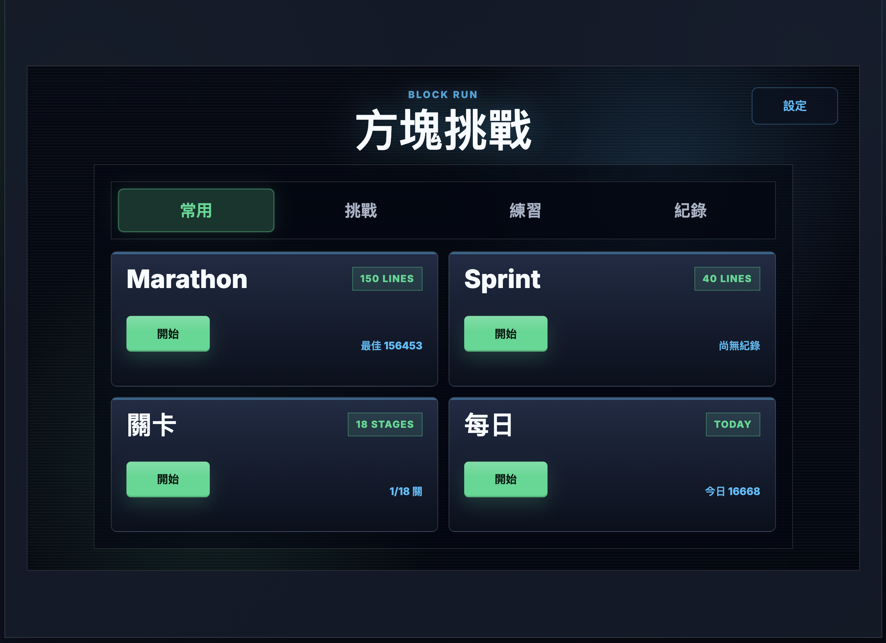
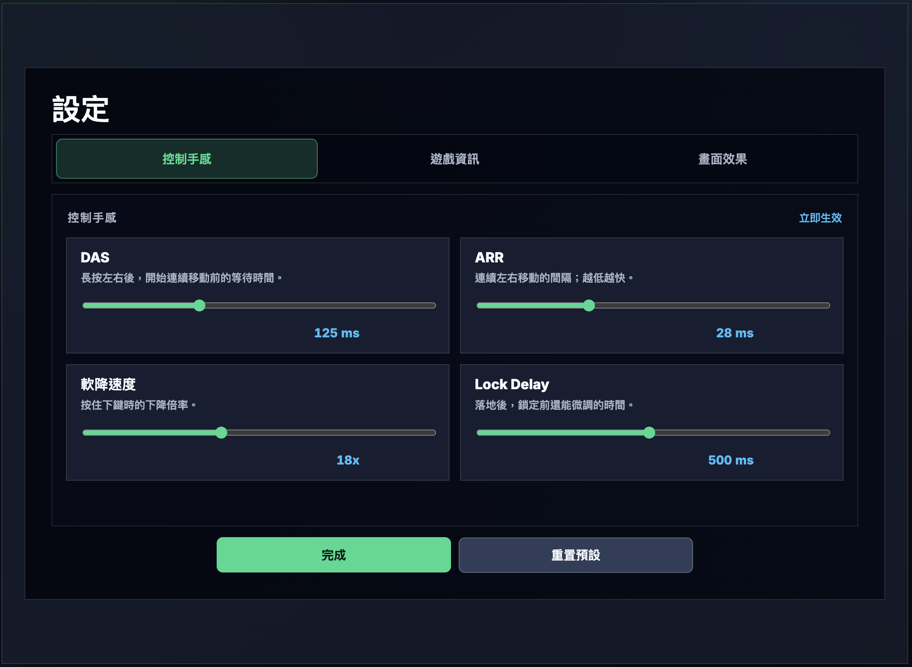

# Block Run / 方塊挑戰

[繁體中文](./README.md) | [English](./README.en.md)

`Block Run` is a browser-based falling-block game built with plain HTML, CSS, and JavaScript. It is designed as a local-first single-player game: no backend, no account system, no online ranking, and no framework build step.

The project started as a prototype and was expanded into a replayable game with modern handling, multiple modes, stage challenges, daily runs, local records, and AI-assisted demo play.

## Screenshots

### Main menu



### In-game HUD



### Settings


## Highlights

- Modern rules and handling:
  supports `7-bag`, `SRS wall kick`, `Hold`, configurable `Next Queue`, `DAS`, `ARR`, `soft drop`, and `lock delay`.
- Multiple game modes:
  includes `Marathon`, `Sprint`, `Ultra`, `Dig`, `Mystery`, `Zen`, `Daily Challenge`, `Stage Mode`, and `Training`.
- Local progression and records:
  best scores, per-mode records, stage stars, achievements, daily records, and recent replay summaries stored in `localStorage`.
- Game-focused UI:
  centered playfield with side HUD panels for goals, queue, hold, and controls.
- Maintainable content:
  UI text, mode labels, descriptions, and stage copy are centralized in `game/src/i18n.js`.

## Modes

- `Marathon`: clear 150 lines, with optional endless continuation.
- `Sprint`: fixed 40-line race with time, PPS, and KPP tracking.
- `Ultra`: 3-minute score attack.
- `Dig`: garbage-clearing practice mode.
- `Mystery`: local event modifiers such as speed shifts, hidden information, reversed preview, or extra garbage.
- `Zen`: relaxed play with undo and clear-board actions.
- `Daily Challenge`: same seed and conditions for the same date.
- `Stage Mode`: 18 handcrafted stages with stars, restrictions, and special rules.
- `Training`: fixed-speed efficiency practice.
- `AI Demo / AI Assist`: automatic play for showcase or observation.

## Quick start

If you just want to run the game locally, use this flow:

1. Start a local static server. The simplest option is Python's built-in `http.server`.
2. Run this from the project root:

```sh
make serve
```

3. Open this URL in your browser:

```text
http://127.0.0.1:8766/index.html
```

If port `8766` is already in use, run:

```sh
make serve PORT=8787
```

Then open:

```text
http://127.0.0.1:8787/index.html
```

## Standalone offline file

If you want to hand this to end users without asking them to run a local server, build the single-file offline version:

```sh
make package
```

Output:

```text
dist/block-run-standalone.html
```

That file can be opened directly in a browser with no `http.server`, `make serve`, or other local server.

## Online demo

Live URL:

```text
https://kenduest.github.io/block-run/
```

When `main` is updated, GitHub Pages redeploys automatically.

## Run locally

This project uses ES modules, so opening `game/index.html` directly with `file://` is not reliable across browsers. Use a local static server instead.

```sh
make serve
```

Then open:

```text
the local URL printed by the command
```

To change the port:

```sh
make serve PORT=<your-port>
```

If `make` is not available in your environment, you can run Python directly:

```sh
cd game
python3 -m http.server 8766 --bind 127.0.0.1
```

## Developer commands

```sh
make help
make serve
make check
make test
make verify
make package
```

- `make serve`: start a local static server for `game/`.
- `make check`: run Node syntax checks on source and test files.
- `make test`: run all test files under `tests/`.
- `make verify`: run `check` and `test`.
- `make package`: build a single-file standalone HTML that works with `file://`.

## Controls

| Key | Action |
| --- | --- |
| `←` `→` | Move |
| `↑` / `X` | Rotate clockwise |
| `Z` | Rotate counterclockwise |
| `↓` | Soft drop |
| `Space` | Hard drop |
| `C` | Hold |
| `A` | Toggle AI Assist |
| `P` / `Esc` | Pause |
| `G` | Toggle ghost piece |
| `R` | Zen undo |
| `V` | Zen clear board |

## Persistence

Game data is stored locally in the browser, including:

- settings
- best scores
- total play stats
- per-mode totals
- stage completion and stars
- achievements
- daily challenge records
- recent replay summaries

If saved data is invalid, the game falls back to normalized defaults instead of requiring manual recovery.

## Project structure

```text
.
├── game/
│   ├── index.html
│   ├── styles.css
│   └── src/
│       ├── ai.js
│       ├── game.js
│       ├── i18n.js
│       ├── modes.js
│       ├── renderer.js
│       ├── rules.js
│       └── storage.js
├── docs/
│   └── README.md
├── .github/
│   └── workflows/
│       ├── ci.yml
│       └── pages.yml
├── scripts/
│   └── build-single-file.mjs
├── dist/
│   └── block-run-standalone.html
├── image/
│   ├── game-screenshot-01.png
│   ├── game-screenshot-02.png
│   └── game-screenshot-03.png
├── Makefile
└── tests/
    ├── ai.test.mjs
    ├── rules.test.mjs
    ├── stages.test.mjs
    └── storage.test.mjs
```

## Architecture notes

- `game/src/game.js`:
  runtime flow, input handling, screen switching, HUD updates, settings, and result/profile views.
- `game/src/rules.js`:
  board logic, piece generation, collision, SRS, line clear, and garbage helpers.
- `game/src/renderer.js`:
  canvas rendering for board, hold, next queue, and visual effects.
- `game/src/modes.js`:
  mode definitions, daily rules, and stage data.
- `game/src/storage.js`:
  persistence, normalization, records, achievements, and replay summaries.
- `game/src/i18n.js`:
  centralized UI copy, mode labels, achievements, and stage text.

## Testing

This project has no package-manager dependency and no build pipeline. Verification runs directly on Node:

```sh
make verify
```

Current tests cover:

- bag generation and rotation rules
- stage dataset coverage
- AI helper logic
- storage normalization and record behavior

## Development notes

- Prefer editing copy in `game/src/i18n.js` instead of scattering strings through runtime logic.
- Keep gameplay rules in `game/src/rules.js` and data definitions in `game/src/modes.js`.
- After layout changes, verify the desktop 16:9 view. The center board should stay visually dominant, and side panels should not clip or introduce layout shift.
- This project intentionally stays framework-free. Extra complexity should have a clear reason.

## License

Released under the [MIT License](./LICENSE).
