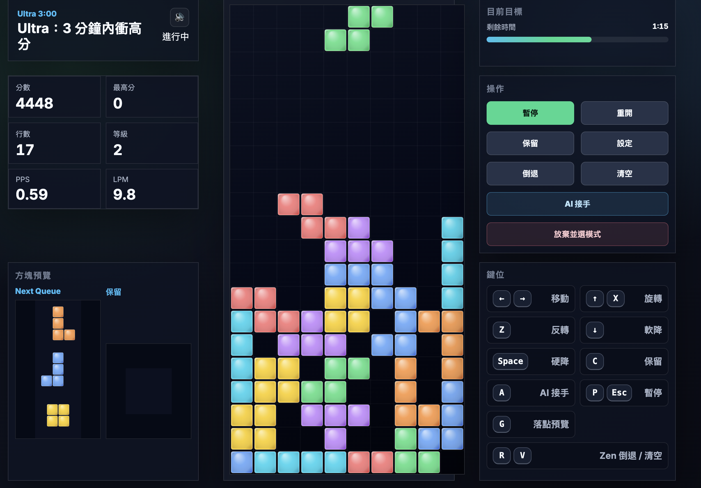

# Block Run / 方塊挑戰

`Block Run` is a browser-based falling-block game built with plain HTML, CSS, and JavaScript. It is designed as a local-first desktop game: no backend, no account system, no online ranking, and no framework build step.

The project started as a simple prototype and has been expanded into a replayable single-player game with modern handling, multiple long-play modes, stage challenges, daily runs, local stats, and AI-assisted demo play.

## Screenshots

### Main menu


### In-game HUD


### Settings



## Highlights

- Modern rules and handling:
  `7-bag`, `SRS wall kick`, `Hold`, configurable `Next Queue`, `DAS`, `ARR`, `soft drop`, and `lock delay`.
- Multiple game modes:
  `Marathon`, `Sprint`, `Ultra`, `Dig`, `Mystery`, `Zen`, `Daily Challenge`, `Stage Mode`, and `Training`.
- Local progression:
  best scores, per-mode records, stage stars, achievements, daily records, and recent replay summaries in `localStorage`.
- Game-focused UI:
  center playfield with side HUD panels for goals, controls, queue, hold, and key hints.
- Content is maintainable:
  UI text, menu labels, mode descriptions, and stage copy are centralized in `game/src/i18n.js`.

## Modes

- `Marathon`: clear 150 lines, with optional endless play.
- `Sprint`: fixed 40-line race with time, PPS, and KPP tracking.
- `Ultra`: 3-minute score attack.
- `Dig`: garbage-clearing practice mode.
- `Mystery`: local event modifiers such as speed shifts, hidden play, reversed preview, or extra garbage.
- `Zen`: relaxed play with undo and clear actions.
- `Daily Challenge`: same seed and conditions for the same date.
- `Stage Mode`: 18 handcrafted stages with stars, restrictions, and special rules.
- `Training`: fixed-speed efficiency practice.
- `AI Demo / AI Assist`: automatic play for showcase or observation.

## Run Locally

This project uses ES modules, so opening `game/index.html` directly with `file://` is not reliable across browsers. Use a local static server instead.

```sh
make serve
```

Then open:

```text
the local URL printed by the server
```

You can change the port if needed:

```sh
make serve PORT=<your-port>
```

## Developer Commands

```sh
make help
make serve
make check
make test
make verify
```

- `make serve`: start a local static server.
- `make check`: syntax-check source and test files with Node.
- `make test`: run all tests under `tests/`.
- `make verify`: run `check` and `test`.

## Controls

| Key | Action |
| --- | --- |
| `←` `→` | Move |
| `↑` / `X` | Rotate clockwise |
| `Z` | Rotate counterclockwise |
| `↓` | Soft drop |
| `Space` | Hard drop |
| `C` | Hold |
| `A` | Toggle AI assist |
| `P` / `Esc` | Pause |
| `G` | Toggle ghost piece |
| `R` | Zen undo |
| `V` | Zen clear board |

## Persistence

Game data is stored locally in the browser. Saved data includes:

- settings
- best scores
- total play stats
- per-mode totals
- stage completion and stars
- achievements
- daily challenge records
- recent replay summaries

If saved data is invalid, the game falls back to normalized defaults instead of requiring manual recovery.

## Project Structure

```text
.
├── game/
│   ├── index.html
│   ├── styles.css
│   └── src/
│       ├── ai.js
│       ├── game.js
│       ├── i18n.js
│       ├── modes.js
│       ├── renderer.js
│       ├── rules.js
│       └── storage.js
├── docs/
│   └── README.md
├── image/
│   ├── game-snapshop-01.png
│   ├── game-snapshop-02.png
│   └── game-snapshop-03.png
├── Makefile
└── tests/
    ├── ai.test.mjs
    ├── rules.test.mjs
    ├── stages.test.mjs
    └── storage.test.mjs
```

## Architecture Notes

- `game/src/game.js`:
  runtime state, input, mode flow, HUD updates, settings, and result/profile screens.
- `game/src/rules.js`:
  board logic, piece generation, collision, SRS, line clear, and garbage helpers.
- `game/src/renderer.js`:
  canvas rendering for board, queue, hold, and effects.
- `game/src/modes.js`:
  mode definitions, daily rules, and stage configurations.
- `game/src/storage.js`:
  persistence, normalization, records, achievements, and replay summaries.
- `game/src/i18n.js`:
  centralized copy for UI, mode labels, achievements, and stage text.

## Testing

The project has no package manager dependency and no build pipeline. Verification runs directly on Node:

```sh
make verify
```

Current tests cover:

- bag generation and rotation rules
- stage dataset coverage
- AI helper logic
- storage normalization and record behavior

## Development Notes

- Prefer editing game copy in `game/src/i18n.js` rather than scattering strings through runtime logic.
- Keep gameplay rules in `game/src/rules.js` and data definitions in `game/src/modes.js`.
- After layout changes, verify the desktop play screen at a 16:9 viewport. The central board should remain visually dominant and side panels should not clip or introduce layout shift.
- This project intentionally stays framework-free. If you add complexity, it should earn its weight.

## License

Released under the [MIT License](./LICENSE).
